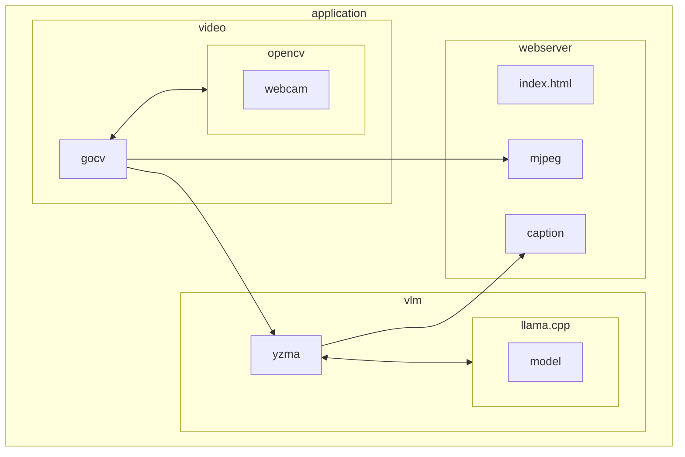

# Captions With Attitude


"Captions With Attitude" in your browser from your webcam generated by a Vision Language Model (VLM) from a Go program running entirely on your local machine using llama.cpp!

It uses [yzma](https://github.com/hybridgroup/yzma) to perform local inference using [`llama.cpp`](https://github.com/ggml-org/llama.cpp) and [GoCV](https://github.com/hybridgroup/gocv) for the video processing, then runs a local web server so you can see the often comedic results.

## Installation

### yzma

You must install yzma and llama.cpp to run this program.

See https://github.com/hybridgroup/yzma/blob/main/INSTALL.md

### GoCV

You must also install OpenCV and GoCV, which unlike yzma requires CGo.

See https://gocv.io/getting-started/

Although yzma does not use CGo, yzma can co-exist in Go applications that use CGo.

### Models

You will need a Vision Language Model (VLM). Download the model and projector files from Hugging Face in `.gguf` format.

***Qwen3-VL-2B-Instruct model***

Model: https://huggingface.co/ggml-org/Qwen3-VL-2B-Instruct-GGUF/blob/main/Qwen3-VL-2B-Instruct-Q8_0.gguf

Projector: https://huggingface.co/ggml-org/Qwen3-VL-2B-Instruct-GGUF/blob/main/mmproj-Qwen3-VL-2B-Instruct-Q8_0.gguf

Install using the `yzma` CLI:

```shell
yzma model get -u https://huggingface.co/ggml-org/Qwen3-VL-2B-Instruct-GGUF/blob/main/Qwen3-VL-2B-Instruct-Q8_0.gguf
yzma model get -u https://huggingface.co/ggml-org/Qwen3-VL-2B-Instruct-GGUF/blob/main/mmproj-Qwen3-VL-2B-Instruct-Q8_0.gguf
```

***Qwen3-VL-8B-Abliterated-Caption-it-GGUF***

Model: https://huggingface.co/mradermacher/Qwen3-VL-8B-Abliterated-Caption-it-GGUF/blob/main/Qwen3-VL-8B-Abliterated-Caption-it.Q4_K_M.gguf

Projector: https://huggingface.co/mradermacher/Qwen3-VL-8B-Abliterated-Caption-it-GGUF/blob/main/Qwen3-VL-8B-Abliterated-Caption-it.mmproj-Q8_0.gguf

Install using the `yzma` CLI:

```shell
yzma model get -u https://huggingface.co/mradermacher/Qwen3-VL-8B-Abliterated-Caption-it-GGUF/blob/main/Qwen3-VL-8B-Abliterated-Caption-it.Q4_K_M.gguf
yzma model get -u https://huggingface.co/mradermacher/Qwen3-VL-8B-Abliterated-Caption-it-GGUF/blob/main/Qwen3-VL-8B-Abliterated-Caption-it.mmproj-Q8_0.gguf
```

## Building

```shell
go build .
```

## Running

### Flags

```shell
$ ./captions-with-attitude 

Usage:
captions-with-attitudes
  -device string
        camera device ID (default "0")
  -host string
        web server host:port (default "localhost:8080")
  -model string
        model file to use
  -p string
        prompt (default "Give a very brief description of what is going on.")
  -projector string
        projector file to use
  -v    verbose logging
```

### Example

```shell
./captions-with-attitude -model ~/models/Qwen3-VL-8B-Abliterated-Caption-it.Q4_K_M.gguf -projector ~/models/Qwen3-VL-8B-Abliterated-Caption-it.mmproj-Q8_0.gguf -p "Describe the scene in the style of William Shakespeare."
```

Now open your web browser pointed to http://localhost:8080/

## How It Works



The "Captions With Attitude" application consists of three main parts:
- Video capture
- Vision Language Model inference using the webcam images and the text prompt
- Web server to serve the page, the streaming video from the webcam, and the latest caption produced by the VLM
