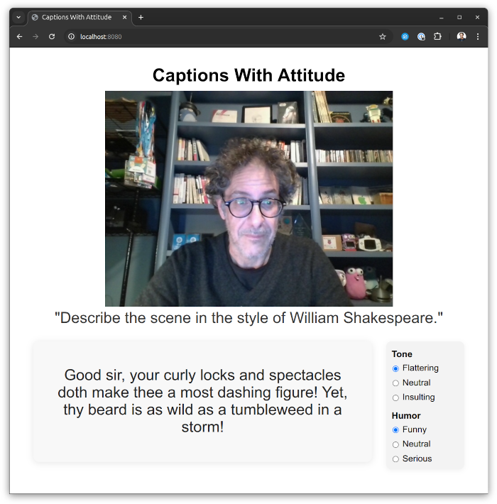
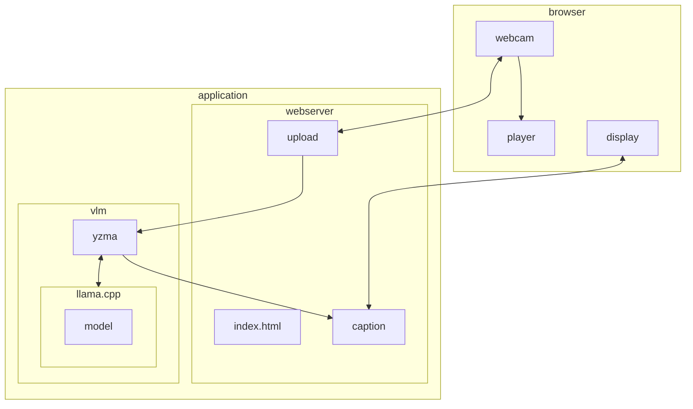

# Captions With Attitude



"Captions With Attitude" in your browser from your webcam generated by a Vision Language Model (VLM) from a Go program running entirely on your local machine using llama.cpp.

It uses [yzma](https://github.com/hybridgroup/yzma) to perform local inference using [`llama.cpp`](https://github.com/ggml-org/llama.cpp), then runs a local web server so you can see the often comedic results.

## Installation

### Self install

If you do not have yzma or the needed models already installed, you can just run this command and the application itself will prompt you for installation:

The self-install will detect if you have CUDA installed on your system, and use the appropriate hardware accelerated version if available.

```
$ go run .
yzma is not installed.
Do you want to install yzma now? (y/n): y
installing llama.cpp version b8038 to ./llama
downloading llama-b8038-bin-ubuntu-x64.tar.gz... 23 MiB of 23 MiB (8.72 MiB/s)
yzma installed successfully.
No model or projector specified, using default models (Qwen3-VL-2B-Instruct-Q4_K_M)
...
```

Now open your web browser pointed to http://localhost:8080/ and activate your webcam.

### Full install

#### yzma

You must install yzma and llama.cpp to run this program.

See https://github.com/hybridgroup/yzma/blob/main/INSTALL.md

#### Models

You will need a Vision Language Model (VLM). Download the model and projector files from Hugging Face in `.gguf` format.

***Qwen3-VL-2B-Instruct model***

https://huggingface.co/bartowski/Qwen_Qwen3-VL-2B-Instruct-GGUF

Install using the `yzma` CLI:

```shell
yzma model get -u https://huggingface.co/bartowski/Qwen_Qwen3-VL-2B-Instruct-GGUF/resolve/main/Qwen_Qwen3-VL-2B-Instruct-Q4_K_M.gguf
yzma model get -u https://huggingface.co/bartowski/Qwen_Qwen3-VL-2B-Instruct-GGUF/resolve/main/mmproj-Qwen_Qwen3-VL-2B-Instruct-f16.gguf
```

***LFM2.5-VL-1.6B-absolute-heresy-MPOA***

https://huggingface.co/mradermacher/LFM2.5-VL-1.6B-absolute-heresy-MPOA-i1-GGUF

Install using the `yzma` CLI:

```shell
yzma model get -u https://huggingface.co/mradermacher/LFM2.5-VL-1.6B-absolute-heresy-MPOA-i1-GGUF/resolve/main/LFM2.5-VL-1.6B-absolute-heresy-MPOA.i1-Q4_K_M.gguf
yzma model get -u https://huggingface.co/mradermacher/LFM2.5-VL-1.6B-absolute-heresy-MPOA-GGUF/resolve/main/LFM2.5-VL-1.6B-absolute-heresy-MPOA.mmproj-Q8_0.gguf
```

## Building

```shell
go build .
```

## Running

### Flags

```shell
$ ./captions-with-attitude 

Usage:
captions-with-attitudes
  -device string
        camera device ID (default "0")
  -host string
        web server host:port (default "localhost:8080")
  -model string
        model file to use
  -p string
        prompt (default "Give a very brief description of what is going on.")
  -projector string
        projector file to use
  -v    verbose logging
```

### Example

```shell
./captions-with-attitude -model ~/models/LFM2.5-VL-1.6B-absolute-heresy-MPOA.mmproj-Q8_0.gguf -projector ~/models/LFM2.5-VL-1.6B-absolute-heresy-MPOA.i1-Q4_K_M.gguf -p "Describe the scene in the style of William Shakespeare."
```

Now open your web browser pointed to http://localhost:8080/

## How It Works



The "Captions With Attitude" application consists of three main parts:
- Video capture
- Vision Language Model inference using the webcam images and the text prompt
- Web server to serve the page, the streaming video from the webcam, and the latest caption produced by the VLM
